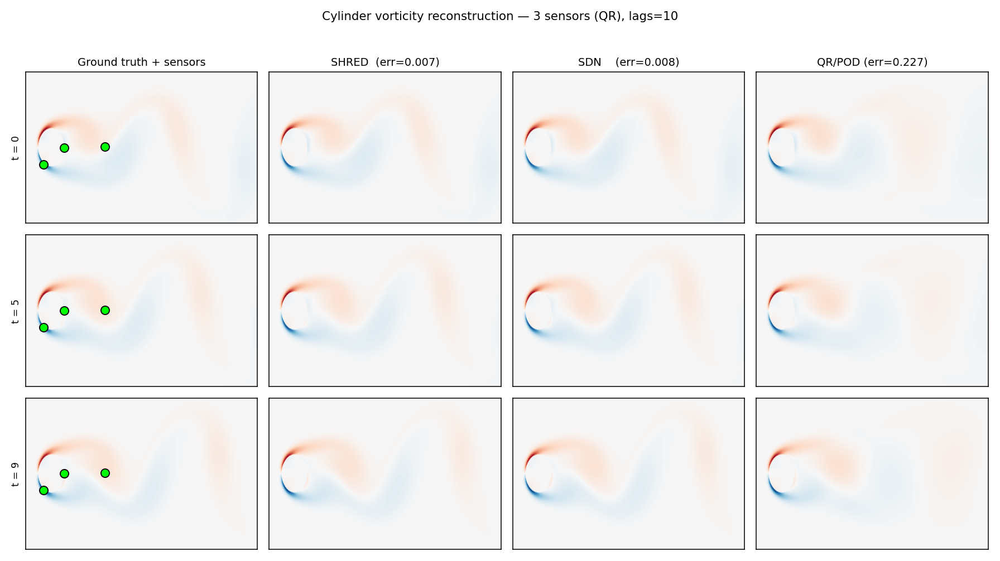
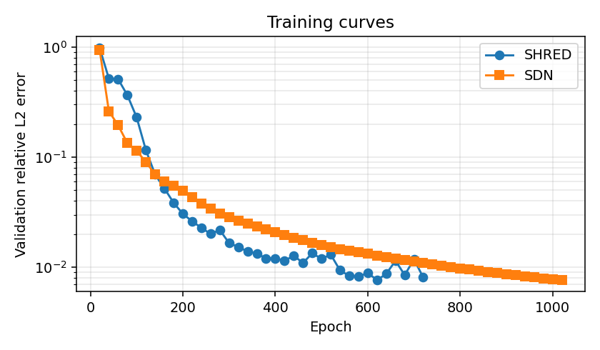
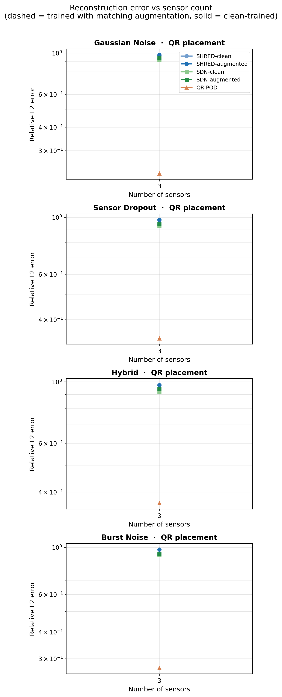
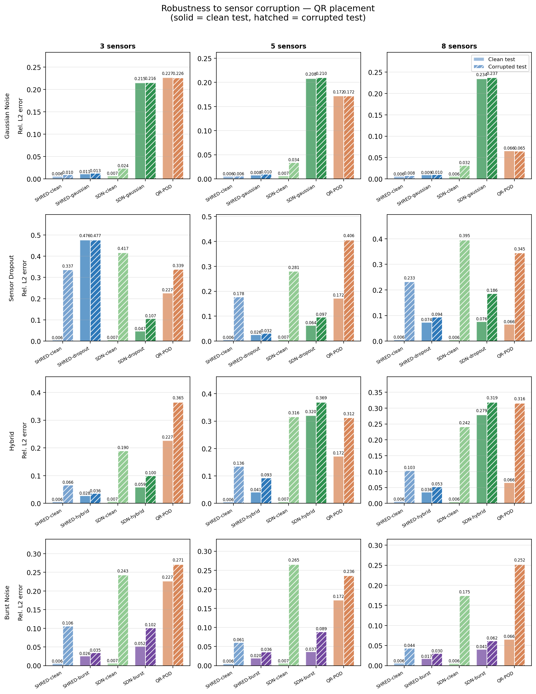
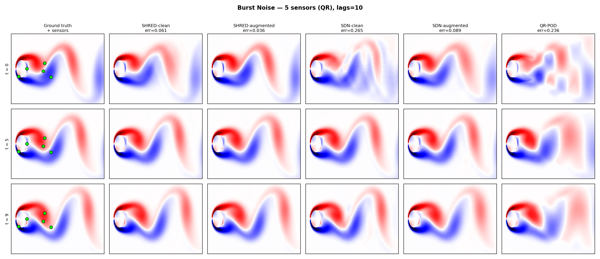

# Supplementary Note on Experiments and Methodology

This document serves as a supplement to our poster presentation (*Robust Field Reconstruction from Sparse Sensors: SHRED vs SDN vs QR-POD under Sensor Corruption*), offering a more detailed narrative of the experiments conducted, our methodology, and the code used to generate the results. 

The full codebase, including model implementations, data processing, and experiment scripts, is available in our repository: [tzikos/get-shredded](https://github.com/tzikos/get-shredded/tree/main).

## Introduction
Our project investigates the reconstruction of high-dimensional fluid-dynamics fields (specifically, fluid flow past a cylinder mapped to vorticity) from a sparse set of point sensors. To achieve this, we implemented and evaluated the **SHallow REcurrent Decoder (SHRED)** network, which uses an LSTM-based architecture to incorporate temporal history to reconstruct spatial fields. 

We compared SHRED against two key baselines: 
1. **SDN (Shallow Decoder Network)**: An ablation of SHRED that uses the same feed-forward decoder but lacks the LSTM temporal memory, relying only on a single spatial snapshot in time.
2. **QR-POD**: A classical, linear non-neural baseline utilizing a gappy-POD formulation coupled with QR-pivoted sensor placement.

## Baseline Performance Modeling
Our first objective was to establish the baseline performance of the three models on clean data. We configured the models to ingest sparse sensor readings and reconstruct the full physical field. By directly comparing SHRED against SDN, we were able to isolate and quantify the impact of incorporating temporal history on reconstruction accuracy. The QR-POD model provided a robust benchmark representing established classical linear reduction methods.

* **Code integration:** The initial baseline comparisons and reconstruction plots were generated using `scripts/run_cylinder_baseline.py`.

## Sensor Placement Strategies and Sweep Analysis
In any real-world physical system, optimally placing a limited number of sensors is critical to reduce costs while retaining signal fidelity. To understand how our models behave under constrained sensor budgets, we conducted parameter sweeps altering the total number of sensors. 

Furthermore, we experimented with sensor placement methods. We tested a greedy QR-pivoted POD placement—which deterministically targets high-variance modes in the data—against uniform random placements. This allowed us to observe which models were more resilient to sub-optimal sensor configurations.

* **Code integration:** The sweep over sensor counts and the cross-placement comparative analyses were performed using `scripts/sweep_num_sensors.py` and `scripts/eval_cross_placement.py`.

## Evaluating and Enhancing Model Robustness
Physical sensors deployed in the real world are prone to calibration errors, signal noise, and outright failures. Our next extensive set of experiments tested how sensitive the ML models were to data perturbations, and whether we could "immunize" them through data augmentation during the training phase.

We subjected both SHRED and SDN to various dynamic augmentation regimes evaluated on QR-pivoted sensor layouts:
- **Gaussian Noise:** Simulating continuous background sensor noise.
- **Dropout:** Simulating complete sensor failure by zeroing out random sensor signals.
- **Hybrid:** A mixed environment where sensors independently experience noise, dropout, or remain clean.
- **Burst:** A contiguous window of timesteps where sensors become corrupted, simulating a transient hardware fault.

* **Code integration:** The extensive robustness training pipelines and augmentation metrics were executed via `scripts/run_robustness_comparison.py` and `scripts/run_robust_shred.py`.

## Experiments Excluded from the Poster and Future Work

Due to the limited space on the poster, some of our deeper verification experiments were excluded. Additionaly, the neural network training methodology was investigated for statistical variance. 
Since training is inherently stochastic due to parameter initialization and data batching, we systematically varied random seeds. We ran cross-validation and evaluated standard deviations across multiple randomized initializations to ensure our margins of error bounded the performance expectations seamlessly. 

We also proposed a new method: RobustSHRED a method which aimed to produce a latent code from the sensor measurements and the hidden state of the LSTM. This should enable the model to handle the different types of noise better. As in theory this latent code should be the same for the same underlying physical state, irrespective of which sensor is noisy. This ensures that the noise does not enter into the LSTM as its input already has the noise filtered out. But when performing cross validation we found that for the improved model, in some seeds it outperformed basic data augmentation greatly, while in others it was much worse. This indicates this extended model was not a good fit for this relatively small dataset, and more research should be done into the possible extensions of SHRED to make it robust to noise. We also aimed to fix this by introducing student-teacher training, where firstly SHRED was triained on a clean dataset. Afterwards on corrupted data, the extended model was trained not to reconstruct the flow field, but instead to match the hidden states of the SHRED trained on clean data. Afterwards the SDN head is unfrozen and fine tuned end to end with this student SHRED. This however resulted in the same failures as training the extended SHRED end to end. 

* **Code integration:** Verification of statistical significance and seed variance tracking was automated using `scripts/cross_val_robust.py` and `scripts/investigate_seeds.py`.

**Future Work:**
A key finding from our test cases revealed that Dropout remains the hardest corruption scenario, pointing to a fundamental architectural constraint natively present in the models. The SHRED network learns fixed input-to-field mappings that cannot dynamically reconcile conflicting or completely missing dropout configurations at inference. Moving towards richer latent representations of the sensor state—as opposed to direct mapping pipelines—is a non-trivial but highly promising direction for future work.

## Conclusion
In conclusion we have shown that baseline SHRED works well for the fluid flow past a cylinder data, even for low number of sensors and random placement. And while in theory with noisy sensors it should be able to still produce good reconstructions, in practice even with data augmentation, it is not able to produce results as good as is achieved with clean data. Finally, an extended SHRED with a latent code was used to try and improve on vanilla SHRED. But the small training data did not allow us to achieve consistent results showing it to work. 

## Declaration of AI Usage
Generative AI and Large Language Models (LLMs) were utilized over the course of this project to assist in the software development lifecycle. Specifically, AI tools provided support for writing boilerplate Python code, accelerating the debugging process, and formatting documentation. The foundational logic, experimental layout, and ultimate data analysis are our original work.

## References
[1] J. Williams, O. Zahn, J. N. Kutz, "Sensing with shallow recurrent decoder networks," *Proc. R. Soc. A* 480:20230816, 2024.
